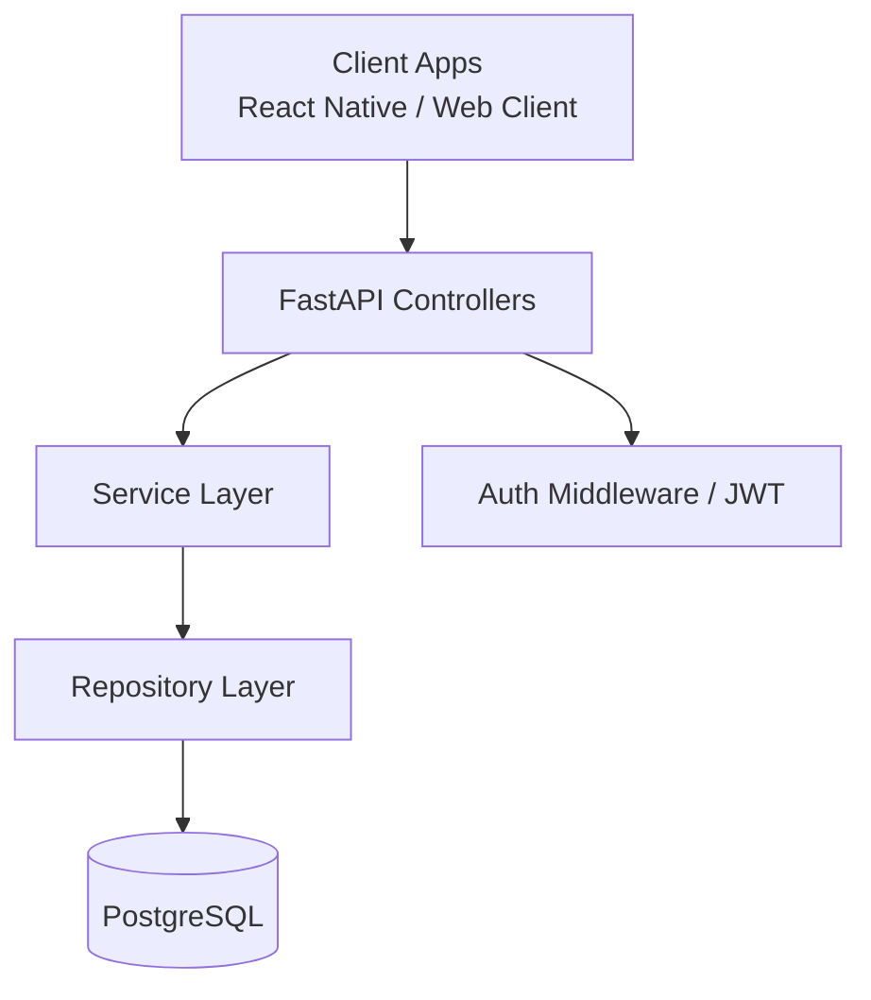

# Developer Guide

Cross-Platform Budgeting Application – Technical Documentation

Current project status:

- Backend API is complete and production-structured.
- Frontend GUI is implemented for cross-platform usage.

## System Overview

Simple Budget is built using:

Frontend:

- React
- React Native
- Expo
- Axios (API communication)

Backend:

- FastAPI
- SQLAlchemy
- PostgreSQL
- JWT Authentication

Hosting:

- Frontend: Vercel
- Backend: Render

---

## Architecture Overview

Client (React Native / Expo)
↓ REST API
FastAPI Backend
↓
PostgreSQL Database

Design Principles:

- RESTful API design
- Separation of concerns
- Stateless authentication (JWT)
- Modular backend structure

### High-Level Architecture Diagram

Architecture explanation:

- Controllers expose REST endpoints and validate request/response contracts.
- Services implement business rules and orchestration.
- Repositories isolate persistence logic for clean data access boundaries.
- PostgreSQL stores budgets, income, expenses, and users.
- JWT middleware protects authenticated endpoints.

---

## Project Structure

simple-budget/
├── backend/
│ ├── app/
│ │ ├── controllers/
│ │ ├── services/
│ │ ├── repositories/
│ │ ├── models/
│ │ ├── schemas/
│ │ ├── utils/
│ │ └── main.py
│ ├── config.py
│ ├── requirements.txt
│ ├── scripts/
│ │ └── export_openapi.py
│ └── tests/
│ └── (test files)
├── .env.example
│── docs
├── README.md
├── requirements.txt (could also be in backend)
└── (possibly other config files)

---

## Local Development Setup

### Backend Setup

Requirements:

- Python 3.10+
- pip

Steps:

1. Navigate to backend directory
2. Create virtual environment
3. Install dependencies:

pip install -r requirements-dev.txt

For runtime-only installs (for example, production containers), use:

pip install -r requirements.txt

4. Run server:

uvicorn app.main:app --reload

Backend runs at:
http://localhost:8000

---

### Frontend Setup

Requirements:

- Node.js 18+

Steps:
npm install
npx expo start

Frontend runs at:
http://localhost:8080

---

## Running Tests

Backend:
pytest -q

### Current Backend Test Structure

- `backend/tests/test_http_controllers.py`: consolidated HTTP/controller tests for endpoint contracts, validation, protected routes, and controller-level error paths.
- `backend/tests/test_error_handlers.py`: consolidated middleware and dependency error-path tests, including error code mapping and auth token edge cases.
- `backend/tests/test_auth_service.py`, `backend/tests/test_budget_service.py`, `backend/tests/test_expense_service.py`, `backend/tests/test_income_service.py`, `backend/tests/test_report_service.py`: service-layer business logic tests.

Frontend:

npm install
npm test -- --coverage

---

## Coding Standards

Backend:

- Follow PEP8
- Use type hints
- Keep functions small and single-responsibility

Frontend:

- Follow ESLint rules
- Functional components preferred
- Use React hooks properly

---

## Contribution Guidelines

- Create feature branch
- Write tests for new features
- Ensure no lint errors
- Submit pull request with description

### Pull Request Process

1. Branch naming convention: `feature/<name>`, `fix/<name>`, `chore/<name>`
2. Keep PRs focused on one change set.
3. Include:
	- Summary of the change
	- How it was tested
	- Any API/contract impact
4. Verify before review:
	- `pytest -q` passes in `backend/`
	- Lint/type checks pass for changed code
5. At least one reviewer approval is required before merge.
