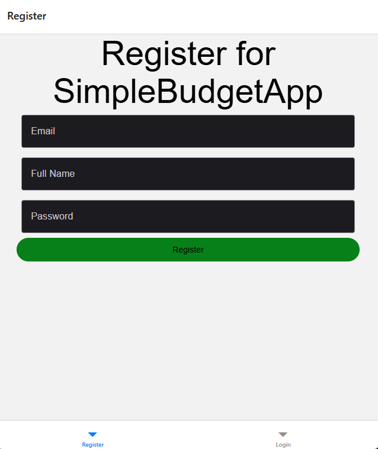
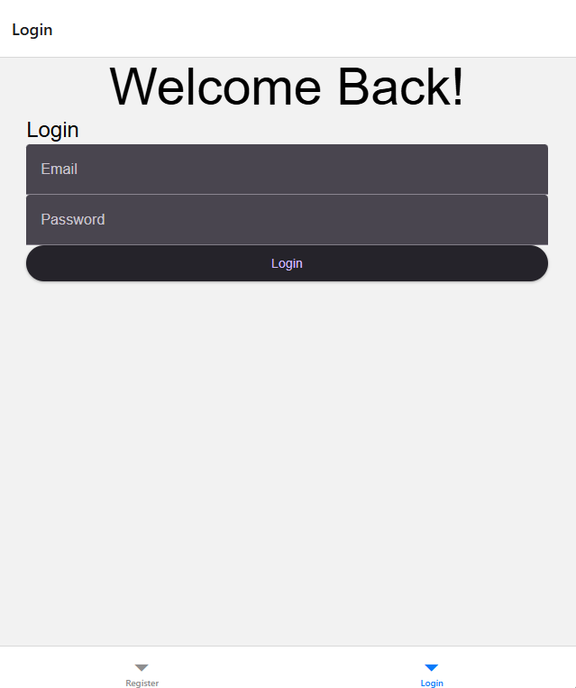
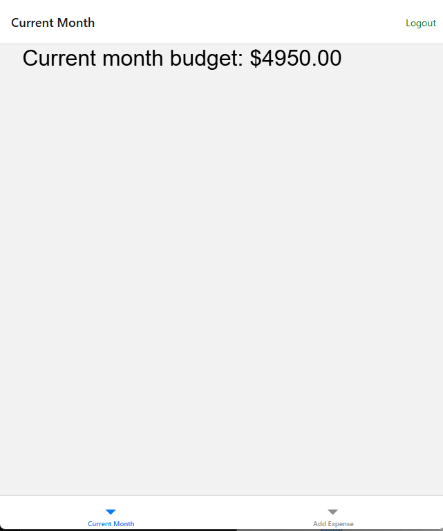
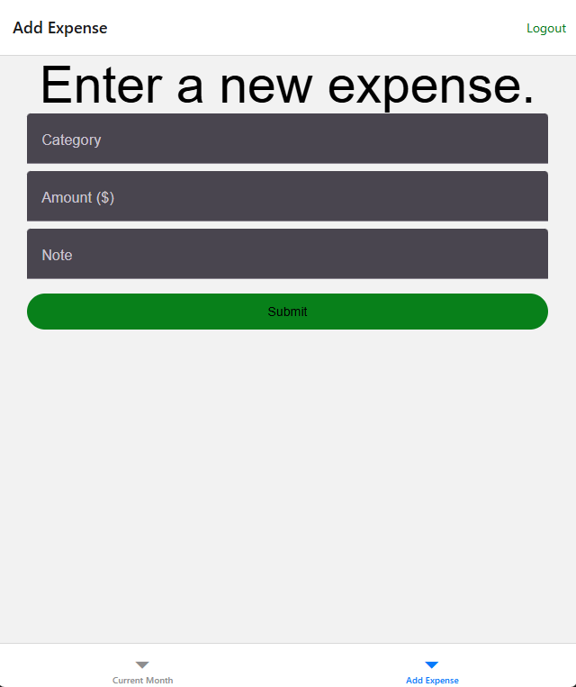
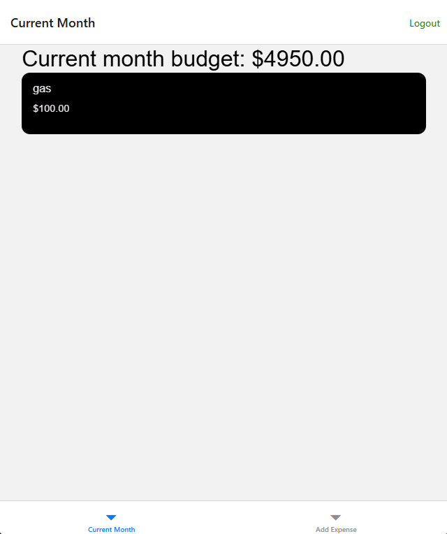

# User Guide

Cross-Platform Budgeting Application

Current project status:

- Backend API is complete and production-structured.
- Frontend GUI is implemented for cross-platform usage.

## Introduction

Simple Budget is a cloud-based budgeting application that allows users to:

- Create monthly budgets
- Track expenses
- View financial summaries
- Access the application via web browser (desktop and mobile)

No installation is required for hosted deployment.

---

## Accessing the Application

1. Open the deployed application URL.
2. Register for a new account.
3. Log in using your credentials.

### Installation and Setup Notes

- Hosted environment: no local installation is required.
- Local/mobile development setup instructions are available in the developer guide.

---

## Registering a New Account

1. Click "Register".
2. Enter:
   - Email address
   - Password
3. Submit the form.
4. Log in using your new credentials.

---

## Logging In

1. Click "Login".
2. Enter email and password.
3. Upon successful login, you will be redirected to the dashboard.

If login fails:

- Verify credentials
- Ensure account is registered

---

## Creating a Budget

1. Navigate to Dashboard.
2. Select "Create Budget".
3. Enter monthly budget amount.
4. Submit.

The dashboard will update automatically.

---

## Adding an Expense

1. Click "Add Expense".
2. Enter:
   - Expense amount
   - Category
   - Description (optional)
3. Submit.

The system automatically recalculates:

- Total spent
- Remaining budget

---

## Viewing Financial Summary

The dashboard displays:

- Monthly budget
- Total expenses
- Remaining balance

---

## Logging Out

Click "Logout" to securely end your session.

---

## Troubleshooting

| Issue                  | Solution              |
| ---------------------- | --------------------- |
| Cannot log in          | Verify email/password |
| Session expired        | Log in again          |
| Dashboard not updating | Refresh browser       |
| Expense not saving     | Check input values    |

---

## Known User Limitations

- No offline functionality
- No email password reset
- No export to CSV feature

---

## Primary Task Screenshots

Add screenshots for the following user flows when preparing release documentation:

1. Registration page (before and after success)
2. Login page (successful login)
3. Dashboard with monthly budget visible
4. Add Expense form (filled and submitted)
5. Updated dashboard summary after expense submission

Screenshot files:

- `docs/images/user/register.png`
- `docs/images/user/login.png`
- `docs/images/user/dashboard-budget.png`
- `docs/images/user/add-expense.png`
- `docs/images/user/dashboard-summary.png`

### Registration Page

### Login Page

### Dashboard (Budget View)

### Add Expense Form

### Dashboard (Updated Summary)

---

## FAQ

### Q: Do I need to install anything to use Simple Budget?

A: No for hosted usage. Open the deployed URL, register, and log in.

### Q: Why was I logged out?

A: Authentication uses expiring JWT sessions. Log in again to continue.

### Q: Why is my dashboard not updated immediately?

A: Refresh the page and verify your latest expense save succeeded.

### Q: Can I export my data?

A: Not currently. CSV/PDF export is tracked as a future enhancement.
